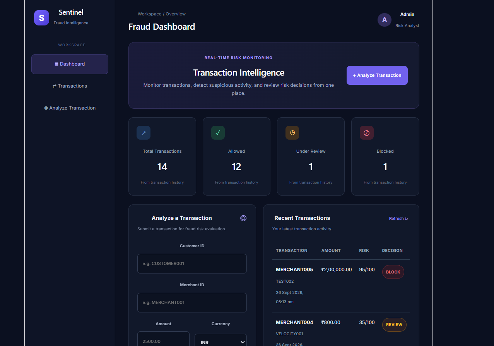

# Sentinel — Real-Time Fraud Detection Platform

A full-stack transaction fraud detection platform that evaluates transactions using configurable rule-based risk checks, assigns risk scores, and classifies transactions as ALLOW, REVIEW, or BLOCK.

Sentinel combines a Spring Boot backend, PostgreSQL database, and React dashboard to provide transaction evaluation, persistence, and monitoring.


## Dashboard Preview



## Features

- **Rule-Based Fraud Detection:** Evaluates transactions using five risk assessment rules.
- **Risk Scoring:** Aggregates rule scores into a risk score ranging from 0 to 100.
- **Transaction Classification:** Classifies transactions as ALLOW, REVIEW, or BLOCK based on configurable thresholds.
- **Transaction History:** Stores evaluated transactions and their risk decisions in PostgreSQL.
- **Interactive Dashboard:** Displays transaction history, risk scores, decisions, and summary metrics.
- **REST APIs:** Provides endpoints for transaction submission and history retrieval.

## Tech Stack

| Layer | Technologies |
|---|---|
| Backend | Java 21, Spring Boot |
| Frontend | React, JavaScript, CSS |
| Database | PostgreSQL |
| Persistence | Spring Data JPA, Hibernate |
| API | REST, JSON |
| Build Tool | Maven |

## System Architecture

```text
                 React Dashboard
                        |
                        | HTTP / JSON
                        v
               Spring Boot REST API
                        |
                        v
                Transaction Service
                        |
                        v
                Fraud Detection Engine
                        |
               Five Risk Assessment Rules
                        |
                        v
                Risk Score Aggregation
                        |
                        v
             ALLOW / REVIEW / BLOCK
                        |
                        v
                PostgreSQL Database
                        |
                        v
              Transaction History API
                        |
                        v
                 React Dashboard
```

## Fraud Detection Rules

Sentinel uses a modular, rule-based approach to evaluate transaction risk.

| Rule | Description | Risk Score |
|---|---|---:|
| High Amount | Flags transactions exceeding ₹100,000. | 80 |
| Foreign Currency | Flags transactions with a currency other than INR. | 25 |
| Large Round Amount | Flags amounts divisible by 10,000. | 15 |
| Merchant Blacklist | Flags transactions involving blacklisted merchants. | 100 |
| Velocity Check | Flags customers exceeding the configured transaction frequency threshold. | 35 |

### Risk Scoring and Decisions

The individual rule scores are aggregated and capped at 100.

| Risk Score | Decision |
|---|---|
| 0–29 | ALLOW |
| 30–69 | REVIEW |
| 70–100 | BLOCK |

The risk score represents a rule-based assessment and is not a calibrated probability of fraud.

## API Endpoints

Base URL: `http://localhost:8080`

### 1. Evaluate a Transaction

**POST** `/api/v1/transactions`

Evaluates an incoming transaction, generates its risk assessment, and persists the transaction and decision.

Example request:

```json
{
  "customerId": "CUST001",
  "merchantId": "MERCHANT001",
  "amount": 150000,
  "currency": "INR"
}
```

The response includes the evaluated transaction details, risk score, decision, and reason.

### 2. Retrieve Transaction History

**GET** `/api/v1/transactions`

Returns the stored transaction history, including transaction details and risk assessments.

## Getting Started

### Prerequisites

Install the following:

- Java 21
- Maven
- Node.js and npm
- PostgreSQL

### 1. Clone the Repository

```bash
git clone https://github.com/ananyapaniraj7/real-time-fraud-detection-platform.git
cd real-time-fraud-detection-platform
```

### 2. Configure PostgreSQL

Create a PostgreSQL database:

```sql
CREATE DATABASE sentinel;
```

Configure the following environment variables before starting the backend:

```text
DB_URL=jdbc:postgresql://localhost:5432/sentinel
DB_USERNAME=postgres
DB_passwd=your_postgresql_password
```

Replace the username and password with your local PostgreSQL credentials.

The application reads its database configuration from environment variables. Do not commit database credentials or other secrets to the repository.

### 3. Run the Backend

Navigate to the backend directory:

```bash
cd backend
```

Start the Spring Boot application:

```bash
mvn spring-boot:run
```

The backend runs at:

`http://localhost:8080`

### 4. Run the Frontend

Open another terminal and navigate to the frontend directory:

```bash
cd frontend
```

Install dependencies:

```bash
npm install
```

Start the React development server:

```bash
npm run dev
```

Open the local URL displayed by Vite in your terminal.

## Project Structure

```text
real-time-fraud-detection-platform/
├── backend/
│   ├── src/
│   │   └── main/
│   │       └── java/
│   │           └── ...
│   └── pom.xml
│
├── frontend/
│   ├── src/
│   │   ├── App.jsx
│   │   └── ...
│   └── package.json
│
├── .gitignore
└── README.md
```

## Current Limitations

- Fraud detection is based on deterministic rules rather than a trained machine learning model.
- The velocity check uses in-memory state and resets when the backend restarts.
- The current implementation is an MVP and has not been benchmarked for production-scale throughput or latency.

## Future Improvements

- Integrate a trained machine learning model for fraud classification.
- Introduce Kafka for asynchronous transaction processing.
- Use Redis for distributed, persistent transaction velocity tracking.
- Add automated integration tests and model evaluation metrics.
- Containerize the application using Docker.

## Author

**Ananya Paniraj**

[GitHub](https://github.com/ananyapaniraj7)